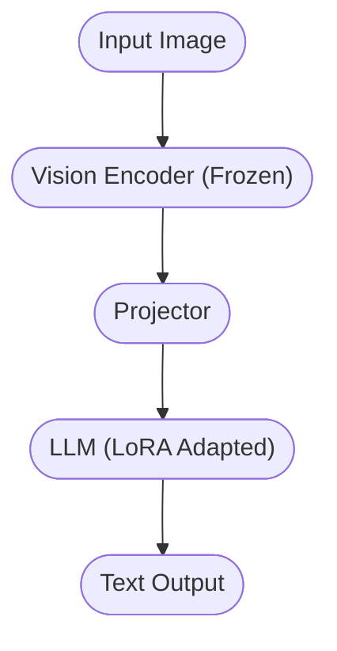

# Langvision: Efficient Vision LLM Fine-Tuning

<div align="center">

<picture>
  <source media="(prefers-color-scheme: dark)" srcset="https://raw.githubusercontent.com/langtrain-ai/langvision/main/static/langvision-white.png">
  
</picture>

### Fine-tune Vision LLMs (LLaVA, Qwen-VL) in minutes

[](https://pypi.org/project/langvision/)
[](https://pepy.tech/project/langvision)
[](LICENSE)
[]()

</div>

---

## What You'll Need

```bash
# Quick system check
python --version 

# Check GPU support (Optional but recommended)
python -c "import torch; print('GPU ready!' if torch.cuda.is_available() else 'CPU mode - still works!')"
```

## Install LangTrain

```bash
# Step 1: Create a clean environment (recommended)
python -m venv langtrain-env
source langtrain-env/bin/activate  # Windows: langtrain-env\Scripts\activate

# Step 2: Install LangVision
pip install langvision

# Step 3: Verify it worked
python -c "import langvision; print('✅ LangVision installed!')"
```

## Train Your First Model

```python
from langvision import LoRATrainer

# Step 1: Define your training data (Images + QA)
training_data = [
    {
        "image": "./images/cat.jpg", 
        "question": "What is in this image?", 
        "answer": "A cute tabby cat sitting on a rug."
    },
    {
        "image": "./images/dog.jpg", 
        "question": "Describe the animal.", 
        "answer": "A golden retriever playing with a ball."
    }
]

# Step 2: Create the trainer
# Configures Vision Encoder + LLM Adapter automatically
trainer = LoRATrainer(
    model_name="llava-v1.6-7b",  # Works with LLaVA, Qwen-VL, BLIP-2 etc.
    output_dir="./my_vision_model",
)

# Step 3: Train!
trainer.train(training_data)

# Step 4: Test your model
model = trainer.load_model()
response = model.chat("./images/cat.jpg", "What do you see?")
print(f"AI: {response}")
```

## Use Your Trained Model

```python
from langvision import ChatModel

# Load your trained model
model = ChatModel.load("./my_vision_model")

# Analyze images
print(model.chat("image1.jpg", "Describe this scene."))
```

## Using Your Own Data

```python
from langvision import LoRATrainer

trainer = LoRATrainer(
    model_name="llava-v1.6-7b",
    output_dir="./custom_vlm",
)

# Method 1: Load from Hugging Face datasets
trainer.train_from_hub("your_username/your_vqa_dataset")
```

## Next Steps

1.  **Train with QLoRA**: Use `QLoRATrainer` to fine-tune LLaVA-7B on consumer GPUs (under 12GB VRAM).
2.  **Explore Model Zoo**: `langvision model-zoo list` to see supported models (LLaVA, Qwen, CogVLM, etc.).
3.  **Read the Docs**: Check out [langtrain.xyz/docs](https://langtrain.xyz/docs).

---

## Architecture Overview

Langvision adapts Vision Transformers (ViT) and Large Language Models (LLM) using LoRA.



## Contributing

Contributions are welcome! See [CONTRIBUTING.md](CONTRIBUTING.md).

## License

MIT License. See [LICENSE](LICENSE).

## Citation

```bibtex
@software{langvision2025,
  author = {Pritesh Raj},
  title = {Langvision: Efficient LoRA Fine-Tuning for Vision LLMs},
  url = {https://github.com/langtrain-ai/langvision},
  year = {2025}
}
```