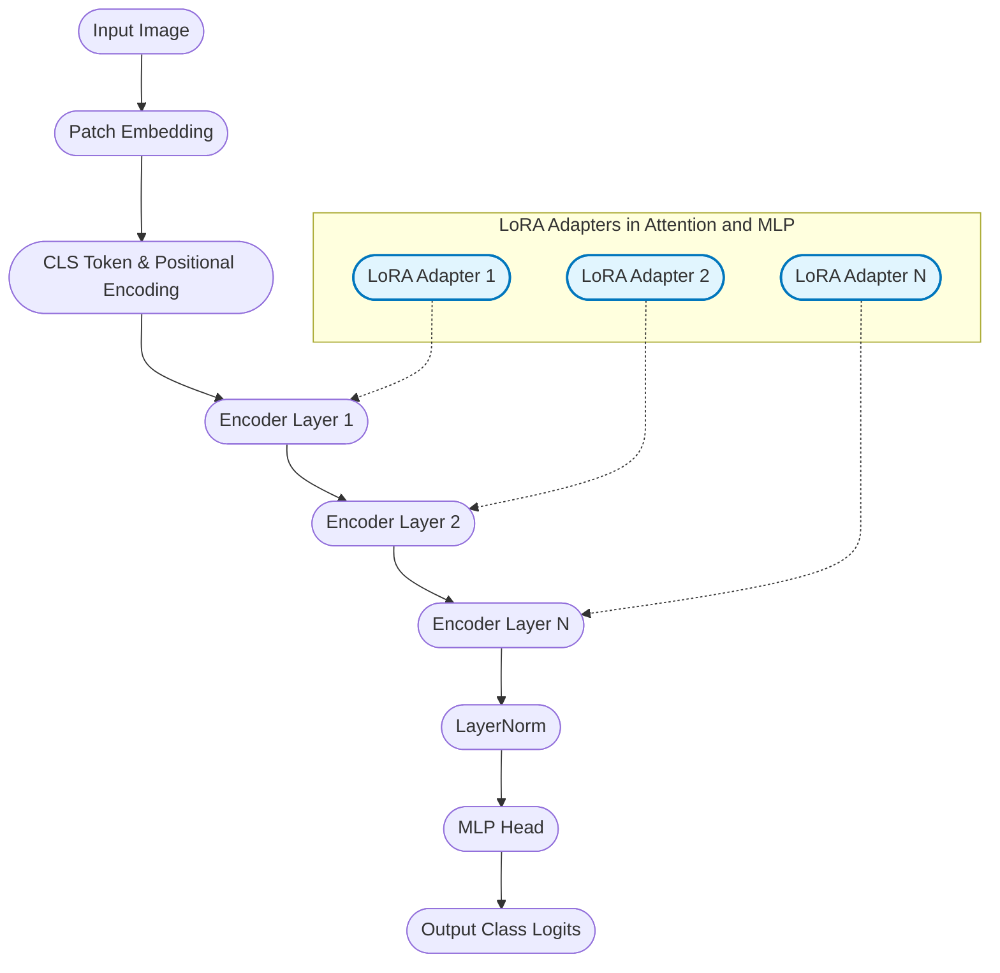

<div align="center">

<picture>
  <source media="(prefers-color-scheme: dark)" srcset="https://raw.githubusercontent.com/langtrain-ai/langvision/main/static/langvision-white.png">
  <source media="(prefers-color-scheme: light)" srcset="https://raw.githubusercontent.com/langtrain-ai/langvision/main/static/langvision-black.png">
  
</picture>

### Efficient LoRA Fine-Tuning for Vision LLMs

[](https://pypi.org/project/langvision/)
[](https://pepy.tech/project/langvision)
[](LICENSE)
[]()
[]()
[](https://github.com/psf/black)

**Fine-tune Vision Transformers with minimal memory footprint using LoRA adapters**

[📦 Installation](#-installation) • [🚀 Quick Start](#getting-started) • [📖 Documentation](docs/index.md) • [🗺️ Roadmap](ROADMAP.md)

</div>

---

## 🚀 Installation

> **Requirements:**  
> - Python 3.8 or newer  
> - [PyTorch](https://pytorch.org/get-started/locally/) (CPU or GPU)

**Install the latest release from PyPI:**

```bash
pip install langvision
```

[](https://pypi.org/project/langvision/)

**Optional installs:**

- For development:
  ```bash
  pip install langvision[dev]
  ```
- For documentation:
  ```bash
  pip install langvision[docs]
  ```
- For examples and notebooks:
  ```bash
  pip install langvision[examples]
  ```
- For GPU (CUDA 11.3+):
  ```bash
  pip install langvision[gpu]
  ```

**Troubleshooting:**
- For GPU support, ensure you have the correct CUDA version and install PyTorch as per [official instructions](https://pytorch.org/get-started/locally/).
- If you encounter issues, see [Troubleshooting](docs/troubleshooting.md) or [open an issue](https://github.com/langtrain-ai/langvision/issues).

---

## Quick Links
- [Documentation](docs/index.md)
- [Tutorials](docs/tutorials/index.md)
- [Changelog](CHANGELOG.md)
- [Contributing Guide](CONTRIBUTING.md)
- [Roadmap](ROADMAP.md)

---

## Table of Contents
- [Features](#features)
- [Showcase](#showcase)
- [Getting Started](#getting-started)
- [Supported Python Versions](#supported-python-versions)
- [Why langvision?](#why-langvision)
- [Architecture Overview](#architecture-overview)
- [Core Modules](#core-modules)
- [Performance & Efficiency](#performance--efficiency)
- [Advanced Configuration](#advanced-configuration)
- [Documentation & Resources](#documentation--resources)
- [Testing & Quality](#testing--quality)
- [Examples & Use Cases](#examples--use-cases)
- [Extending the Framework](#extending-the-framework)
- [Contributing](#contributing)
- [License](#license)
- [Citation](#citation)
- [Acknowledgements](#acknowledgements)
- [Advanced LLM Concepts](#advanced-llm-concepts)

---

## Features

### 🧠 Vision LLM Fine-Tuning
- **LoRA/QLoRA adapters** for memory-efficient fine-tuning
- Support for **LLaVA, BLIP-2, Qwen-VL, InternVL, CogVLM, Phi-3 Vision** and more
- Pre-configured LoRA target modules for each model family
- Mixed precision (FP16/BF16) and gradient checkpointing

### 🔧 Training & Optimization
- Advanced training with **RLHF, DPO, PPO** support
- Configurable learning rate schedulers and optimizers
- Automatic checkpointing and training resume
- Distributed training across multiple GPUs

### 📦 Model Zoo
- **14+ Vision LLM models** ready for fine-tuning
- Vision encoders: CLIP, SigLIP, EVA-CLIP
- Recommended LoRA configs for each model
- Easy model download and management

### 🛠️ Developer Experience  
- Comprehensive CLI with intuitive commands
- YAML/JSON configuration system
- Callback support (early stopping, logging, W&B)
- Export to ONNX and TorchScript

---

## Supported Vision LLMs

| Model Family | Models | Use Cases |
|--------------|--------|-----------|
| **LLaVA** | 1.6-7B, 1.6-13B | Visual QA, Image Captioning, Visual Reasoning |
| **Qwen-VL** | Qwen-VL-Chat, Qwen2-VL-7B | Multilingual VQA, Document OCR, Video |
| **BLIP-2** | Flan-T5-XL, OPT-6.7B | Image Captioning, Zero-shot Classification |
| **InternVL** | InternVL2-8B | OCR, Chart/Document Understanding |
| **CogVLM** | CogVLM2-Llama3 | GUI Agent, Fine-grained Recognition |
| **Phi-3 Vision** | 128K context | Long-context Vision, Document Understanding |
| **IDEFICS** | IDEFICS2-8B | Visual QA, Multi-image Understanding |

---

## Getting Started

Install:

```bash
pip install langvision
```

### Authentication

Langvision requires an API key. Get yours at [langtrain.xyz](https://langtrain.xyz):

```bash
# Login with your API key
langvision auth login

# Check authentication status
langvision auth status

# View usage
langvision auth usage
```

### CLI Usage

After installation, you can use the comprehensive CLI:

```bash
# Show all available commands
langvision --help

# Authentication
langvision auth login

# Model management
langvision model-zoo list              # List all Vision LLMs
langvision model-zoo list --type vlm   # List Vision-Language models only
langvision model-zoo info llava-v1.6-7b    # Get model details
```

**Fine-tuning Vision LLMs:**

```bash
# Fine-tune LLaVA for Visual QA
langvision finetune \
  --model llava-v1.6-7b \
  --dataset your_vqa_dataset \
  --lora_r 64 \
  --epochs 3 \
  --batch_size 4

# Fine-tune Qwen-VL with DPO
langvision finetune \
  --model qwen2-vl-7b \
  --dataset preference_data \
  --method dpo \
  --lora_r 64

# Fine-tune BLIP-2 for image captioning
langvision finetune \
  --model blip2-flan-t5-xl \
  --dataset coco_captions \
  --lora_r 32 \
  --epochs 5

# Evaluate a fine-tuned model
langvision evaluate --checkpoint ./outputs/llava-lora --dataset vqav2

# Export to ONNX
langvision export --checkpoint ./outputs/llava-lora --format onnx
```

### Python API

```python
from langvision import ModelZoo, AdvancedTrainer, TrainingConfig
from langvision.models.lora import LoRAConfig

# Browse available Vision LLMs
zoo = ModelZoo()
vlm_models = zoo.list_vlm_models()
for model in vlm_models:
    print(f"{model['name']}: {model['description']}")

# Get recommended LoRA config for a model
lora_config = zoo.get_lora_config("llava-v1.6-7b")
print(f"LoRA rank: {lora_config['r']}")
print(f"Target modules: {lora_config['target_modules']}")

# Fine-tune with custom config
config = TrainingConfig(
    model_name="llava-v1.6-7b",
    dataset_path="./my_vqa_data",
    lora_r=64,
    lora_alpha=128,
    learning_rate=2e-4,
    epochs=3,
    batch_size=4,
    gradient_checkpointing=True,
)

trainer = AdvancedTrainer(config)
trainer.train()
```

See the [Documentation](docs/index.md) and [src/langvision/cli/finetune.py](src/langvision/cli/finetune.py) for more details.

---

## Supported Python Versions
- Python 3.8 or newer

---

## Why langvision?

- Fine-tuning with LoRA adapters
- Modular ViT backbone design
- Unified interface for vision models
- Suitable for research and production
- Efficient memory usage

---

## Architecture Overview

Langvision uses a Vision Transformer backbone with LoRA adapters in attention and MLP layers. This enables adaptation of pre-trained models with fewer trainable parameters.

### Model Data Flow



---

## Core Modules

| Module | Description | Key Features |
|--------|-------------|--------------|
| PatchEmbedding | Image-to-patch conversion and embedding | Configurable patch sizes, position embeddings |
| TransformerEncoder | Multi-layer transformer backbone | Self-attention, LoRA integration, checkpointing |
| LoRALinear | Low-rank adaptation layers | Configurable rank, memory-efficient updates |
| MLPHead | Output projection layer | Classification, regression, dropout |
| Config System | Centralized configuration | YAML/JSON config, CLI overrides |
| Data Utils | Preprocessing and augmentation | Built-in transforms, custom loaders |

---

## Performance & Efficiency

| Metric | Full Fine-tuning | LoRA Fine-tuning | Improvement |
|--------|------------------|------------------|-------------|
| Trainable Parameters | 86M | 2.4M | 97% reduction |
| Memory Usage | 12GB | 4GB | 67% reduction |
| Training Time | 4h | 1.5h | 62% faster |
| Storage per Task | 344MB | 9.6MB | 97% smaller |

*Benchmarks: ViT-Base, CIFAR-100, RTX 3090*

Supported model sizes: ViT-Tiny, ViT-Small, ViT-Base, ViT-Large

---

## Advanced Configuration

Example LoRA config:

```python
lora_config = {
    "rank": 16,
    "alpha": 32,
    "dropout": 0.1,
    "target_modules": ["attention.qkv", "attention.proj", "mlp.fc1", "mlp.fc2"],
    "merge_weights": False
}
```

Example training config:

```yaml
model:
  name: "vit_base"
  img_size: 224
  patch_size: 16
  num_classes: 1000
training:
  epochs: 10
  batch_size: 32
  learning_rate: 1e-4
  weight_decay: 0.01
  warmup_steps: 1000
lora:
  rank: 16
  alpha: 32
  dropout: 0.1
```

---

## Documentation & Resources
- [API Reference](docs/index.md)
- [Tutorials and Examples](docs/tutorials/index.md)
- [Research Papers](#research-papers)
- [Best Practices Guide](docs/best_practices.md)
- [Troubleshooting](docs/troubleshooting.md)

### Research Papers
- [LoRA: Low-Rank Adaptation of Large Language Models](https://arxiv.org/abs/2106.09685)
- [An Image is Worth 16x16 Words: Transformers for Image Recognition at Scale](https://arxiv.org/abs/2010.11929)
- [Vision Transformer for Fine-Grained Image Classification](https://arxiv.org/abs/2103.07579)

---

## Testing & Quality

Run tests:

```bash
pytest tests/
```

Code quality tools:

```bash
flake8 src/
black src/ --check
mypy src/
bandit -r src/
```

---

## Examples & Use Cases

Image classification:

```python
from langvision import VisionTransformer
from langvision.datasets import CIFAR10Dataset

model = VisionTransformer.from_pretrained("vit_base_patch16_224")
dataset = CIFAR10Dataset(train=True, transform=model.default_transform)
model.finetune(dataset, epochs=10, lora_rank=16)
```

Custom dataset:

```python
from langvision.datasets import ImageFolderDataset

dataset = ImageFolderDataset(
    root="/path/to/dataset",
    split="train",
    transform=model.default_transform
)
model.finetune(dataset, config_path="configs/custom_config.yaml")
```

---

## Extending the Framework
- Add datasets in `src/langvision/data/datasets.py`
- Add callbacks in `src/langvision/callbacks/`
- Add models in `src/langvision/models/`
- Add CLI tools in `src/langvision/cli/`

## Documentation
- See code comments and docstrings for details.
- For advanced usage, see `src/langvision/cli/finetune.py`.

## Contributing
Contributions are welcome. See the [Contributing Guide](CONTRIBUTING.md) for details.

## License

This project is licensed under the MIT License. See [LICENSE](LICENSE) for details.

## Citation

If you use langvision in your research, please cite:

```bibtex
@software{langvision2025,
  author = {Pritesh Raj},
  title = {Langvision: Efficient LoRA Fine-Tuning for Vision LLMs},
  url = {https://github.com/langtrain-ai/langvision},
  year = {2025},
  version = {0.1.0}
}
```

## Acknowledgements

We thank the following projects and communities:
- [PyTorch](https://pytorch.org/)
- [HuggingFace](https://huggingface.co/)
- [timm](https://github.com/rwightman/pytorch-image-models)
- [PEFT](https://github.com/huggingface/peft)

<p align="center">
  <b>Made in India 🇮🇳 with ❤️ by the langtrain team</b><br/>
  <i>Star ⭐ this repo if you find it useful!</i>
</p>

## Advanced LLM Concepts

This library is designed to be extensible with advanced concepts in large language models (LLMs) and explainable AI, including:

- **RLHF**: Reinforcement Learning from Human Feedback
- **CoT**: Chain-of-Thought
- **CCoT**: Contrastive Chain-of-Thought
- **GRPO**: Generalized Reinforcement Policy Optimization
- **RLVR**: Reinforcement Learning with Value Ranking
- **DPO**: Direct Preference Optimization
- **PPO**: Proximal Policy Optimization
- **LIME**: Local Interpretable Model-agnostic Explanations
- **SHAP**: SHapley Additive exPlanations

See the [`src/langvision/concepts/`](src/langvision/concepts/) directory for modularized explanations and stubs for each concept. These serve as a foundation for future development and integration into the library's training and evaluation workflows.